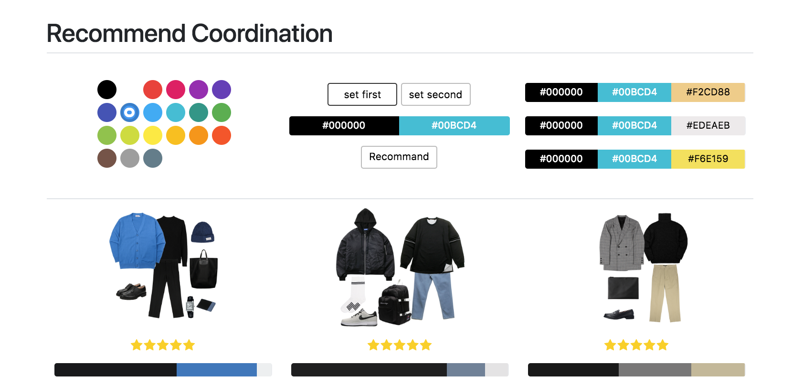
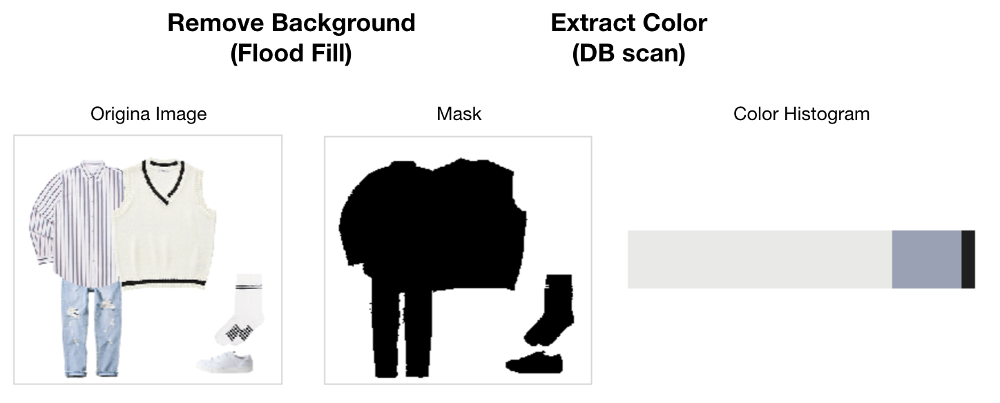
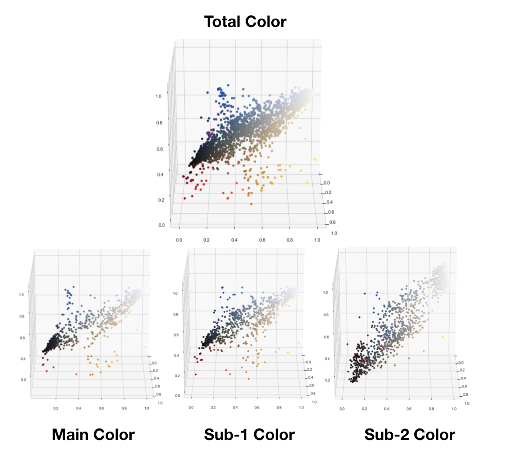
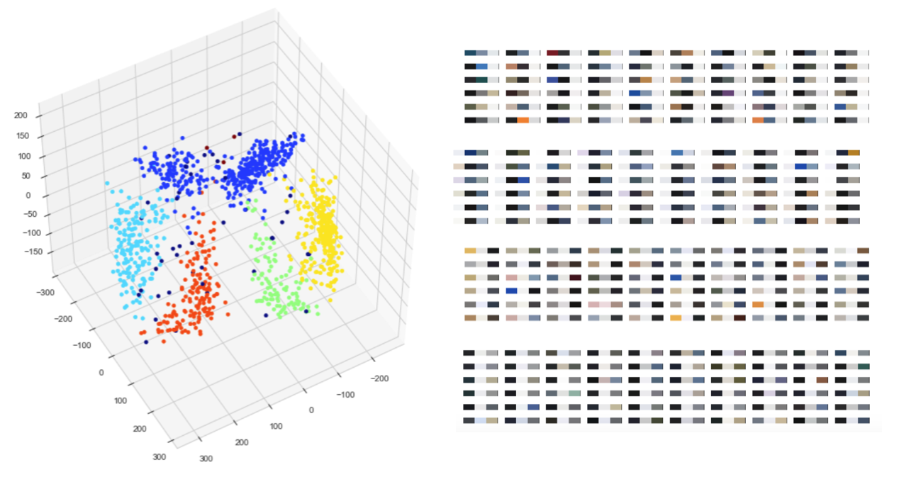
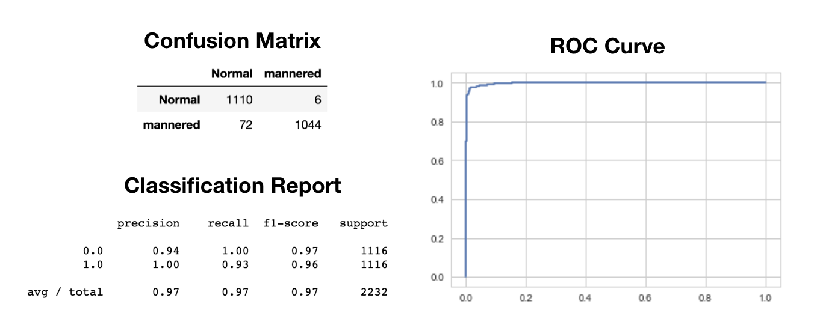
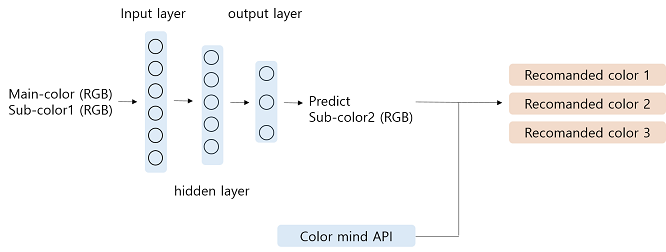
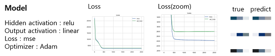
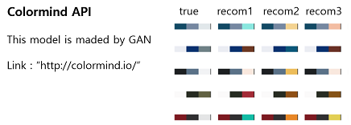
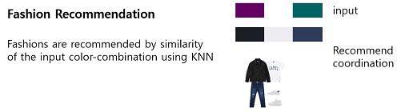

# Fashion-Coordination Recommendation

**Project Site** [http://dooyeoung.ml](http://dooyeoung.ml/)

---

> This is a web-site that recommend the fashion-coordination using MLP and QDA.
>
> - Recommand color-combination using MLP and Colormind API.
> - Evaluate the quality of color-combination using QDA.
> - Recommend the fashion by similarity of the input color-combination.

## 1. Code

##### skill

> - numpy, pandas, sklearn, keras, openCV
> - web : flask, sqlArchemy, bootstrap, MySQL

##### Code

>codi_flask : flask
>
>data : csv, sql file
>
>model : model(QDA, MLP) 
>
>utils : function
>
>- imageprocessing.py : Extract color
>- qda_goodbad.py : Evaluate the quality
>- recommand_color.py : Recommand colors
>
>Important jupyter notebook
>
>- EDA : Cluster, analysis_color
>- QDA : NaiveBayes
>- MLP : Recommand_color
>- Crawling : crawling_mapssi, download_image  

## 2. Method

### 2-1. Color Extraction

### 2-2. EDA

- **Scatter**

- **Clustering (DBSCAN)**

### 2-3. Quality Evaluation (QDA)
- Generate mannered datas in random
- QDA Modeling for predict normal/mannered

### 2-4. Color Recommendation

##### 2-4-1. **Overall method**

- Recommended color 1 : The nearest color with predict color using colormind API
- Recommended color 2 : predict color
- Recommended color 3 : The second color with predict color using colormind API

##### 2-4-2. **MLP Model**

##### 2-4-3.**Colormind API**

The most predict-color is gray, so we use colormind API for variety of colors.

### 2-5. Fashion Recommendation (KNN)

